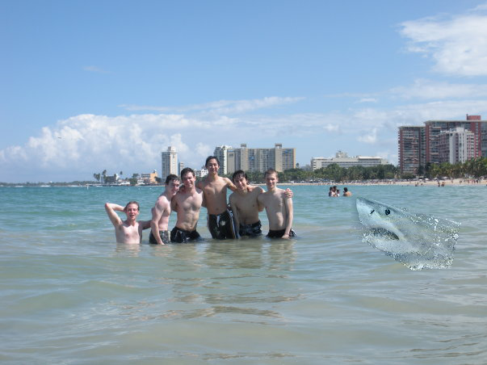

# reports of assignment01~04 for DIP (Digital Image Processing)


## Assignment04

### 原理&代码
```

#compute jacobian
J_proj[:, 0, 0] = K[0,0]/cam_points[:,2]  # dx/dX
J_proj[:, 0, 1] = 0  # dx/dY
J_proj[:, 0, 2] = -(K[0,0]*cam_points[:,0])/(cam_points[:,2]*cam_points[:,2])  # dx/dZ
J_proj[:, 1, 0] = 0  # dy/dX
J_proj[:, 1, 1] = K[1,1] / cam_points[:,2]  # dy/dY
J_proj[:, 1, 2] = -(K[1,1]*cam_points[:,1]) / (cam_points[:,2]*cam_points[:,2])   # dy/dZ


# compute gaussian value
det_covs = torch.det(covs2D)  # (N,)
inv_covs = torch.linalg.inv(covs2D)  # (N, 2, 2)

# Compute the Mahalanobis distance (N, H, W)
dx_cov_inv = torch.einsum('nhwi,nij->nhwj', dx, inv_covs)  # (N, H, W, 2)

mahalanobis = torch.sum(dx_cov_inv * dx, dim=-1)  # (N, H, W)

# Compute Gaussian values (N, H, W)
gaussian = (1. / (2 * torch.pi * det_covs.sqrt())).unsqueeze(-1).unsqueeze(-1) * torch.exp(-0.5 * mahalanobis)  # (N, H, W)


#alpha composition
T = torch.cumprod(torch.cat([torch.ones(1, self.H, self.W, device=alphas.device), 1 - alphas[:-1]], dim=0), dim=0)
weights = alphas * T
```
### 结果


## Assignment03

### 原理&代码
**pix2pix**

通用的image to image translation框架

GAN:

U-net:

/TBD

**dragGAN**

依次运行
```
python invert.py
python landmark_dect.py
python make_it_smile.py
```


### 结果

**pix2pix**
/TBD

**dragGAN**

输入-中间输出-输出

<p align="center">
  
  
  
</p>


## Assignment02 
### 原理&代码

**泊松融合**


Create a binary mask from polygon points
```
#扫描线算法

```
Calculate the Laplacian loss between the foreground and blended image

```
laplacian_kernel= torch.tensor([[0, 1, 0], [1, -4, 1], [0, 1, 0]], device=foreground_img.device)
laplacian_kernel=laplacian_kernel.unsqueeze_(0).unsqueeze_(0).repeat(3, 3, 1, 1).float()

#在前景和背景上做一次卷积``
foreground_img = torch.nn.functional.conv2d(foreground_img, laplacian_kernel, padding=1)
blended_img = torch.nn.functional.conv2d(blended_img, laplacian_kernel, padding=1)

(foreground_minx,foreground_miny),(foreground_maxx,foreground_maxy)=get_mask_bounds(foreground_mask)
(background_minx,background_miny),(background_maxx,background_maxy)=get_mask_bounds(background_mask)


diff_fore=foreground_img[:,:,foreground_miny:foreground_maxy+1,foreground_minx:foreground_maxx+1] * foreground_mask[:,:,foreground_miny:foreground_maxy+1,foreground_minx:foreground_maxx+1]
diff_back=blended_img[:,:,background_miny:background_maxy+1,background_minx:background_maxx+1] * background_mask[:,:,background_miny:background_maxy+1,background_minx:background_maxx+1]
loss = torch.sum(torch.abs(diff_fore - diff_back))
```


**pix2pix**

FCN - Fully Convolutional Network

```
self.conv1 = nn.Sequential(
    nn.Conv2d(3, 8, kernel_size=4, stride=2, padding=1),  # Input channels: 3, Output channels: 8
    nn.BatchNorm2d(8),
    nn.ReLU(inplace=True)
)
self.conv2=nn.Sequential(
    nn.Conv2d(8, 64, kernel_size=4, stride=2, padding=1),  # Input channels: 8, Output channels: 64
    nn.BatchNorm2d(64),
    nn.ReLU(inplace=True)
)
self.conv3=nn.Sequential(
    nn.Conv2d(64, 128, kernel_size=4, stride=2, padding=1),  # Input channels: 64, Output channels: 128
    nn.BatchNorm2d(128),
    nn.ReLU(inplace=True)
)
self.conv4=nn.Sequential(
    nn.Conv2d(128, 256, kernel_size=4, stride=2, padding=1),  # Input channels: 128, Output channels: 256
    nn.BatchNorm2d(256),
    nn.ReLU(inplace=True)
)
self.conv5=nn.Sequential(
    nn.Conv2d(256, 512, kernel_size=4, stride=2, padding=1),  # Input channels: 256, Output channels: 512
    nn.BatchNorm2d(512),
    nn.ReLU(inplace=True)
)
self.conv6=nn.Sequential(
    nn.Conv2d(512, 1024, kernel_size=4, stride=2, padding=1),  # Input channels: 512, Output channels: 1024
    nn.BatchNorm2d(1024),
    nn.ReLU(inplace=True)
)
self.conv7=nn.Sequential(
    nn.Conv2d(1024, 2048, kernel_size=4, stride=2, padding=1),  # Input channels: 1024, Output channels: 2048
    nn.BatchNorm2d(2048),
    nn.ReLU(inplace=True)
)
self.conv8=nn.Sequential(
    nn.Conv2d(2048, 4096, kernel_size=4, stride=2, padding=1),  # Input channels: 2048, Output channels: 4096
    nn.BatchNorm2d(4096),
    nn.ReLU(inplace=True)
)
# Decoder (Deconvolutional Layers)

self.convT1=nn.Sequential(
    nn.ConvTranspose2d(4096, 2048, 2, stride=2, padding=0),
    nn.ReLU(inplace=True)
)

self.convT2=nn.Sequential(
    nn.ConvTranspose2d(2048, 1024, 2, stride=2, padding=0),
    nn.ReLU(inplace=True)
)

self.convT3=nn.Sequential(
    nn.ConvTranspose2d(1024, 512, 2, stride=2, padding=0),
    nn.ReLU(inplace=True)
)
self.convT4=nn.Sequential(
    nn.ConvTranspose2d(512, 256, 2, stride=2, padding=0),
    nn.ReLU(inplace=True)
)
self.convT5=nn.Sequential(
    nn.ConvTranspose2d(256, 128, 2, stride=2, padding=0),
    nn.ReLU(inplace=True)
)
self.convT6=nn.Sequential(
    nn.ConvTranspose2d(128, 64, 2, stride=2, padding=0),
    nn.ReLU(inplace=True)
)
self.convT7=nn.Sequential(
    nn.ConvTranspose2d(64, 8, 2, stride=2, padding=0),
    nn.ReLU(inplace=True)
)
self.convT8=nn.Sequential(
    nn.ConvTranspose2d(8, 3, 2, stride=2, padding=0),
    nn.Tanh()
)

```


### 结果
**泊松融合**

等式-蒙娜丽莎-鲨鱼

<p align="center">
  
  
  
</p>


**pix2pix**
<p align="center">
  
  
</p>


## Assignment01 


### 原理&代码

**global transformation**

/TBD

**point transformation**

/TBD

### 结果

**global transformation**


**point transformation**

<p align="center">
  
  
</p>


---


## 编程入门资料

- [Python 入门](https://github.com/walter201230/Python)
- [OpenCV Docs](https://codec.wang/docs/opencv)
- [PyTorch 入门](https://github.com/datawhalechina/thorough-pytorch)
- [作业提交模板](https://github.com/paperswithcode/releasing-research-code/blob/master/templates/README.md)
- [上课课件](https://rec.ustc.edu.cn/share/705bfa50-6e53-11ef-b955-bb76c0fede49) 

